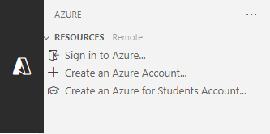

---
lab:
  title: "Ejercicio: Interacción con una API mínima de ASP.NET\_Core"
  module: 'Module: Interact with an ASP.NET Core minimal API'
---

En este ejercicio, ejecutará una API mínima de ASP.NET Core localmente y explorará la API y el código subyacente. También publicará la API en Azure App Service. 

Después de completar este módulo, podrá hacer lo siguiente:

* Navegar por una API documentada
* Determinar puntos de conexión para operaciones HTTP
* Identificar de los requisitos de operación en la API
* Publicar una aplicación en Azure App Service

## Requisitos previos

Para completar el ejercicio, necesita que las herramientas siguientes estén instaladas en el sistema:

* [Visual Studio Code.](https://code.visualstudio.com)
* [El SDK de .NET 7.0 más reciente.](https://dotnet.microsoft.com/download/dotnet/7.0)
* La [extensión de C#](https://marketplace.visualstudio.com/items?itemName=ms-dotnettools.csharp) para Visual Studio Code.
* La extensión [Recursos de Azure](https://marketplace.visualstudio.com/items?itemName=ms-azuretools.vscode-azureresourcegroups) para Visual Studio Code.
* La extensión [Azure App Service](https://marketplace.visualstudio.com/items?itemName=ms-azuretools.vscode-azureappservice) para Visual Studio Code.
* Una cuenta de Azure con una suscripción activa. Si aún no tiene una, puede solicitar una prueba gratuita en [https://azure.com/free](https://azure.com/free).

**Tiempo estimado para finalizar este ejercicio**: 30 minutos

## Información de API

La API interactúa con una base de datos en memoria que contiene los siguientes campos:

Campo | Tipo | Descripción
--- | --- | ---
`id` | integer | Clave para los datos
`name` | string | Nombre de la fruta
`instock` | boolean | Indica si la fruta tiene existencias

La documentación de Swagger se creó mediante el paquete Swashbuckle.

>**Nota:** Los datos de muestra se crean cada vez que se inicia la API.


## Descargar y ejecutar del código de Fruit API

En esta sección hará lo siguiente:

* Descargar el código de API
* Ejecutar de manera local la API
* Abrir la documentación de la API en un explorador

### Tarea 1: Descargar el código de API

1. Haga clic con el botón derecho en el siguiente vínculo y seleccione la opción **Guardar vínculo como**. 

    * [Código de proyecto de FruitAPI](https://raw.githubusercontent.com/MicrosoftLearning/APL-2002-develop-aspnet-core-consumes-api/master/Allfiles/Downloads/FruitAPI.zip)

1. Inicie **Explorador de archivos** y vaya a la ubicación donde se guardó el archivo.

1. Descomprima el archivo en su propia carpeta.

#### Tarea 2: Ejecutar el código de API de manera local

1. Inicie Visual Studio Code y seleccione **Archivo** y elija **Abrir carpeta...** en la barra de menús.

1. Vaya a la ubicación donde descomprimió los archivos del proyecto y seleccione la carpeta *FruitAPI*.

1. La estructura del proyecto en el panel **Explorador** debe ser similar a la captura de pantalla siguiente. Si el panel **Explorador** no está visible, seleccione **Ver** y, a continuación, **Explorador** en la barra de menús.

    

1. Abra un terminal seleccionando **Terminal** y, a continuación, **Nuevo terminal**, o use el método abreviado de teclado **Ctrl+Mayús+'**.

1. En el panel **Terminal**, ejecute el comando `dotnet` siguiente:

    ```
    dotnet run
    ```

1. A continuación se muestra un ejemplo de la salida que verá en el panel **Terminal**. Anote la línea `Now listening on: http://localhost:5050` de la salida. Identifica el host y el puerto de la API.

    ```
    info: Microsoft.EntityFrameworkCore.Update[30100]
          Saved 3 entities to in-memory store.
    info: Microsoft.Hosting.Lifetime[14]
          Now listening on: http://localhost:5050
    info: Microsoft.Hosting.Lifetime[0]
          Application started. Press Ctrl+C to shut down.
    info: Microsoft.Hosting.Lifetime[0]
          Hosting environment: Development
    info: Microsoft.Hosting.Lifetime[0]
          Content root path: 
          <project location>
    ```

### Tarea 3: Abrir la documentación de la API en un explorador

1. Para ver la API, puede escribir  la barra de direcciones `http://localhost:5050` o puede usar **Ctrl+Clic** en el vínculo `Now listening on: http://localhost:5050` del **Terminal** mostrado anteriormente. La página mostrará un mensaje “Esta página localhost no se encuentra”.

1. Anexe la dirección URL en el explorador con `/swagger`. El punto de conexión `/swagger` suele ser donde encontrará la documentación de una API de Swagger. La dirección URL completa de la documentación de Swagger es `http://localhost:5050/swagger`. El explorador debería mostrar una página web similar a la siguiente captura de pantalla:

    

## Realización de operaciones en la API

En esta sección hará lo siguiente:

* Realizar varias operaciones en los datos de muestra
* Identificar los requisitos de punto de conexión y datos para las operaciones

### Tarea 1: Realizar una operación `GET`

1. Expanda la operación **GET** en la sección **Obtener toda la fruta** haciendo clic en cualquier parte del cuadro de operación **GET**.

1. Explore las secciones de la operación y anote la información que se muestra en la tabla siguiente.

    | Sección | Descripción |
    |---|--|
    | **Punto de conexión** | Se muestra en el encabezado de la operación. El punto de conexión se muestra como `/fruitlist`. El URI completo es la dirección URL base de la API anexada con el punto de conexión especificado, `http://localhost:5050/fruitlist` en nuestro ejemplo. |
    | **Parámetros** | Ninguno necesario para esta operación. |
    | **Tipo de elemento multimedia** | Especifica la codificación de tipo multimedia que devolverá la operación. |
    | **Valor de ejemplo** | Muestra el esquema de los datos devueltos por la operación. Tenga en cuenta que esta operación devuelve una matriz JSON. |

1. Ejecute la operación seleccionando el botón **Pruébelo** y, después, seleccione **Ejecutar**.

1. La sección **Respuestas** de la operación se ha actualizado con nueva información. Tenga en cuenta lo siguiente:

    * **Dirección URL de solicitud:** dirección URL a la que se accede en la operación.
    * **Respuesta del servidor:** muestra el código correcto de la operación y el **cuerpo de la respuesta** muestra los tres registros de ejemplo.

### Tarea 2: Realizar una operación `POST`

1. Expanda la operación **POST** en la sección **Agregar fruta a la lista** haciendo clic en cualquier parte del cuadro de operación **POST**.

1. Explore las secciones de la operación y anote la información que se muestra en la tabla siguiente.

    | Sección | Descripción |
    |---|--|
    | **Punto de conexión** | El punto de conexión se muestra como `/fruitlist`. El URI completo es la dirección URL base de la API anexada con el punto de conexión especificado, `http://localhost:5050/fruitlist` en nuestro ejemplo. |
    | **Parámetros** | Ninguno necesario para esta operación. |
    | **Cuerpo de la solicitud** | El **cuerpo de la solicitud** es necesario, ya que la API espera que los datos se agreguen a la lista y se espera el tipo de elemento multimedia `application/json`. |
    | **Valor de ejemplo** | Muestra el esquema de los datos que espera recibir la API. |  

1. Para ejecutar la operación, seleccione el botón **Probarlo.** 

1. Reemplace el JSON en el cuadro de entrada de la sección **Cuerpo de la solicitud** por lo siguiente:

    ```json
    {
        "id": 0,
        "name": "Pear",
        "instock": true
    }
    ```

    >**Nota:** La base de datos le asignará su propio valor de índice al agregar datos para que solo tenga que haber un valor en el campo `id`.

1. La sección **Respuestas** de la operación se ha actualizado con nueva información. Tenga en cuenta lo siguiente:

    * **Dirección URL de solicitud:** dirección URL a la que se accede en la operación.
    * **Respuesta del servidor:** muestra el código correcto de la operación y el **cuerpo de la respuesta** muestra el registro agregado en la base de datos.

1. Ejecute el comando `GET` en la sección **Obtener todas las frutas de la lista** y tenga en cuenta que ahora se incluye un registro para *Pera*.

### Tarea 3: Realizar una operación `DELETE`

1. Expanda la operación **DELETE** en la sección **Eliminar fruta por id.** haciendo clic en cualquier parte del cuadro de operación **DELETE**.

1. Explore las secciones de la operación y anote la información que se muestra en la tabla siguiente.

    | Sección | Descripción |
    |---|--|
    | **Punto de conexión** | El punto de conexión se muestra como `/fruitlist/{id}`. El URI completo es la dirección URL base de la API anexada con el `id` especificado para la eliminación. Por ejemplo, `http://localhost:5050/fruitlist/1` apunta al registro donde `id` es igual a `1`.
    | **Parámetros** | Requiere que se pase el `id` del registro en la dirección URL de la solicitud. |

1. Para ejecutar la operación, seleccione el botón **Probarlo.** 

1. Elimine el registro `Apple` de los datos de muestra escribiendo un elemento `1` en el campo `id` de la sección **Parámetros** y, a continuación, seleccione **Ejecutar**.

1. La sección **Respuestas** de la operación se ha actualizado con nueva información. Tenga en cuenta lo siguiente:

    * **Dirección URL de solicitud:** dirección URL a la que se accede en la operación.
    * **Cuerpo de la respuesta:** muestra el registro eliminado.
    * **Código:**  muestra el código correcto de la operación.

1. Ejecute el comando `GET` en la sección **Obtener todas las frutas de la lista** y tenga en cuenta que se ha eliminado el registro para *Manzana*.

Cuando tenga todo listo para pasar a la sección siguiente del ejercicio:

* Cierre el explorador y detenga Fruit API escribiendo `Ctrl + C` en el terminal en el que se ejecuta.

## Publique la API en Azure App Service

En esta sección hará lo siguiente:

* Usar la extensión Recursos de Azure para conectarse a Azure
* Usar la extensión de Azure App Service para publicar la API en App Service

### Tarea 1: iniciar sesión en Azure

1. Seleccione la extensión Recursos de Azure para abrir el panel.

    

1. Seleccione **Inicie sesión en Azure...**

    Se abrirá una ventana del explorador para iniciar sesión en su cuenta de Azure. Puede cerrar esta ventana una vez completado el proceso de inicio de sesión. 

1. Una vez completado el inicio de sesión, la extensión mostrará una lista de suscripciones disponibles en su cuenta. Aparece un ejemplo en la siguiente captura de pantalla.

    

### Tarea 2: crear una nueva aplicación web

1. Seleccione **Ctrl + Mayús + P** para abrir la paleta de comandos y escriba **Crear nueva aplicación web** para filtrar la lista y seleccione la opción **Azure App Service: Crear nueva aplicación web... (avanzado)**. 

1. Si la cuenta tiene varias suscripciones, se le pedirá que seleccione la suscripción que desea usar para la implementación. 

1. Escriba un nombre único global para la nueva aplicación web. Puede probar `fruitapi-<name>` y reemplazar `<name>` por el nombre o las iniciales.

1. Seleccione **+Crear nuevo grupo de recursos** y acepte el valor predeterminado o escriba `fruitapi-rg`.

1. Seleccione **.NET 7 (STS)** como pila de runtime.

1. Seleccione **Linux** como Sistema operativo.

1. Seleccione una ubicación cercana a la suya para los nuevos recursos.

1. Seleccione **Crear nuevo plan de App Service** y acepte el valor predeterminado o escriba otro nombre. 

1. Seleccione **Free (F1) Pruebe Azure sin coste** para el plan de tarifa.

1. Seleccione **Omitir por ahora** cuando se le pida un nuevo recurso de Application Insights.

La herramienta creará los recursos necesarios en Azure y compilará el código.

### Tarea 3: implementar la aplicación web y examinar el sitio en ejecución

1. Una vez que se creen los recursos y el código haya completado la compilación de una ventana, aparecerá una ventana en la que se le pedirá que **implemente**, seleccione la opción **Implementar**. 

    El sistema compilará una versión de versión del código y la implementará en los recursos que creó anteriormente.

1. Cuando la implementación haya completado una nueva ventana emergente aparecerá con la opción **Examinar sitio web**, seleccione **Examinar sitio web**.

1. En la nueva ventana del explorador, escriba `/swagger` al final de la dirección URL. 

Enhorabuena, ha implementado la API en Azure App Service.

>**Nota:** Se recomienda eliminar recursos de Azure que ya no necesite. Puede quitar todos los recursos creados en esta sección del ejercicio mediante la eliminación del grupo de recursos creado anteriormente en Azure Portal.

## Revisar

En este ejercicio ha aprendido a hacer lo siguiente:

* Navegar por una API documentada
* Determinar puntos de conexión para operaciones HTTP
* Identificar de los requisitos de operación en la API
* Publicar una aplicación en Azure App Service 
