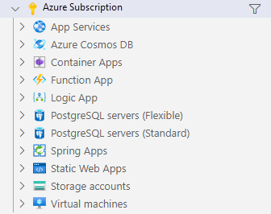

---
lab:
  title: "Ejercicio: Interacción con una API mínima de ASP.NET\_Core"
  module: 'Module: Interact with an ASP.NET Core minimal API'
---

En este ejercicio, ejecutará una API mínima de ASP.NET Core localmente y explorará la API y el código subyacente. También se publica la API en Azure App Service. 

Después de completar este ejercicio, podrás hacer lo siguiente:

* Navegar por una API documentada
* Determinar puntos de conexión para operaciones HTTP
* Identificar los requisitos de API para operaciones HTTP
* Publicar la aplicación en Azure App Service

## Requisitos previos

Para completar el ejercicio, se necesita que las herramientas siguientes estén instaladas en el equipo:

* [Visual Studio Code](https://code.visualstudio.com)
* [El SDK de .NET 7.0 más reciente](https://dotnet.microsoft.com/download/dotnet/7.0)
* [La extensión C#](https://marketplace.visualstudio.com/items?itemName=ms-dotnettools.csharp) para Visual Studio Code
* La extensión [Azure Resources](https://marketplace.visualstudio.com/items?itemName=ms-azuretools.vscode-azureresourcegroups) para Visual Studio Code.
* La extensión [Azure App Service](https://marketplace.visualstudio.com/items?itemName=ms-azuretools.vscode-azureappservice) para Visual Studio Code.
* Una cuenta de Azure con una suscripción activa. Si aún no tiene una, puede solicitar una prueba gratuita en [https://azure.com/free](https://azure.com/free).

**Tiempo estimado para finalizar este ejercicio**: 30 minutos

## Información sobre la API

La API interactúa con una base de datos en memoria que contiene los siguientes campos:

Campo | Tipo | Descripción
--- | --- | ---
`id` | integer | Clave para los datos
`name` | string | Nombre de la fruta
`instock` | boolean | Indica si la fruta está disponible

La documentación de Swagger se creó mediante el paquete Swashbuckle.

>**Nota:** Los datos de ejemplo se crean cada vez que se inicia la API.


## Descarga y ejecución del código de Fruit API

En esta sección hará lo siguiente:

* Descarga el código de API
* Ejecución local de la API
* Abre la documentación de API en un explorador

### Tarea 1: Descarga del código de API

1. Haz clic con el botón derecho en el siguiente vínculo y selecciona la opción **Guardar vínculo como**. 

    * [Código de proyecto FruitAPI](https://raw.githubusercontent.com/MicrosoftLearning/APL-2002-develop-aspnet-core-consumes-api/master/Allfiles/Downloads/FruitAPI.zip)

1. Inicia el **Explorador de archivos** y ve a la ubicación donde se guardó el archivo.

1. Descomprime el archivo en su propia carpeta.

#### Tarea 2: Ejecución local de la API

1. Inicia Visual Studio Code, selecciona **Archivo** y, luego, **Abrir carpeta...** en la barra de menús.

1. Ve a la ubicación donde descomprimiste los archivos del proyecto y selecciona la carpeta *FruitAPI*.

1. La estructura del proyecto en el panel **Explorer** debe ser similar a la captura de pantalla siguiente. Si el panel **Explorer** no está visible, selecciona **Vista** y, luego, **Explorer** en la barra de menús.

    

1. Selecciona **Terminal** para abrir uno y, después, ** Nuevo terminal**, o usa la combinación de teclas **Ctrl+Mayús+`**.

1. En el panel **Terminal**, ejecuta el comando `dotnet` siguiente:

    ```
    dotnet run
    ```

1. A continuación se muestra un ejemplo de la salida que se ve en el panel **Terminal**. Observa la línea `Now listening on: http://localhost:5050` de la salida. Identifica el host y el puerto de la API.

    ```
    info: Microsoft.EntityFrameworkCore.Update[30100]
          Saved 3 entities to in-memory store.
    info: Microsoft.Hosting.Lifetime[14]
          Now listening on: http://localhost:5050
    info: Microsoft.Hosting.Lifetime[0]
          Application started. Press Ctrl+C to shut down.
    info: Microsoft.Hosting.Lifetime[0]
          Hosting environment: Development
    info: Microsoft.Hosting.Lifetime[0]
          Content root path: 
          <project location>
    ```

### Tarea 3: Apertura de la documentación de la API en un explorador

1. Para ver la API, puedes escribir `http://localhost:5050` en la barra de direcciones o puedes pulsar **Ctrl+hacer clic** en el vínculo `Now listening on: http://localhost:5050` del **Terminal** mostrado anteriormente. La página mostrará el mensaje “No se encuentra esta página localhost”.

1. Anexa la URL en el explorador con `/swagger`. El punto de conexión `/swagger` suele ser donde encontrarás la documentación de una API de Swagger. La URL completa de la documentación de Swagger es `http://localhost:5050/swagger`. Ahora, el explorador debería mostrar una página web similar a la siguiente captura de pantalla:

    

## Realización de operaciones en la API

En esta sección hará lo siguiente:

* Realizar varias operaciones en los datos de ejemplo
* Identificar los requisitos de punto de conexión y datos para las operaciones

### Tarea 1: Realización de una operación `GET`

1. Expande la operación **GET** en la sección **Obtener todas las frutas** al hacer clic en cualquier parte del cuadro de operaciones **GET**.

1. Explora las secciones de la operación y observa la información que se muestra en la tabla siguiente.

    | Sección | Descripción |
    |---|--|
    | **Punto de conexión** | Se muestra en el encabezado de la operación. El punto de conexión se muestra como `/fruitlist`. El URI completo es la URL base de la API anexada con el punto de conexión especificado, `http://localhost:5050/fruitlist` en nuestro ejemplo. |
    | **Parámetros** | No es necesario ninguno para esta operación. |
    | **Tipo de medio** | Especifica la codificación del tipo de medio que devolverá la operación. |
    | **Valor de ejemplo** | Muestra el esquema de los datos devueltos por la operación. Ten en cuenta que esta operación devuelve una matriz JSON. |

1. Ejecuta la operación al seleccionar el botón **Pruébalo** y, luego, selecciona **Ejecutar**.

1. La sección **Respuestas** de la operación se ha actualizado con información nueva. Tener en cuenta lo siguiente:

    * **URL de la solicitud:** la URL a la que se accede en la operación.
    * **Respuesta del servidor:** muestra el código correcto de la operación y el cuerpo de la **Respuesta** muestra los tres registros de ejemplo.

### Tarea 2: Realización de una operación `POST`

1. Expande la operación **POST** en la sección **Agregar fruta a la lista** al hacer clic en cualquier parte del cuadro de operaciones **POST**.

1. Explora las secciones de la operación y observa la información que se muestra en la tabla siguiente.

    | Sección | Descripción |
    |---|--|
    | **Punto de conexión** | El punto de conexión se muestra como `/fruitlist`. El URI completo es la URL base de la API anexada con el punto de conexión especificado, `http://localhost:5050/fruitlist` en nuestro ejemplo. |
    | **Parámetros** | No es necesario ninguno para esta operación. |
    | **Cuerpo de la solicitud** | El **cuerpo de la solicitud** es necesario, ya que la API espera que los datos se agreguen a la lista y espera el tipo de medio `application/json`. |
    | **Valor de ejemplo** | Muestra el esquema de los datos que espera recibir la API. |  

1. Para ejecutar la operación, selecciona el botón **Pruébalo**. 

1. Reemplaza JSON en el cuadro de entrada de la sección **Cuerpo de la solicitud** por lo siguiente:

    ```json
    {
        "id": 0,
        "name": "Pear",
        "instock": true
    }
    ```

    >**Nota:** La base de datos le asignará su propio valor de índice al agregar datos para que solo tenga que haber un valor en el campo `id`.

1. La sección **Respuestas** de la operación se ha actualizado con información nueva. Tener en cuenta lo siguiente:

    * **URL de la solicitud:** la URL a la que se accede en la operación.
    * **Respuesta del servidor:** muestra el código correcto de la operación y el **Cuerpo de la respuesta ** muestra el registro agregado a la base de datos.

1. Ejecuta el comando `GET` en la sección **Obtener todas las frutas de la lista** y ten en cuenta que ahora se incluye un registro para *Pera*.

### Tarea 3: Realización de una operación `DELETE`

1. Expande la operación **DELETE** en la sección **Eliminar fruta por id.** al hacer clic en cualquier parte del cuadro de operaciones **DELETE**.

1. Explora las secciones de la operación y observa la información que se muestra en la tabla siguiente.

    | Sección | Descripción |
    |---|--|
    | **Punto de conexión** | El punto de conexión se muestra como `/fruitlist/{id}`. El URI completo es la URL base de la API anexada con el `id` especificado para su eliminación. Por ejemplo, `http://localhost:5050/fruitlist/1` apunta al registro en el que `id` es igual a `1`.
    | **Parámetros** | Requiere que el `id` del registro se pase en la URL de la solicitud. |

1. Para ejecutar la operación, selecciona el botón **Pruébalo**. 

1. Elimina el registro `Apple` de los datos de ejemplo al escribir `1` en el campo `id` de la sección **Parámetros** y, luego, selecciona **Ejecutar**.

1. La sección **Respuestas** de la operación se ha actualizado con información nueva. Tener en cuenta lo siguiente:

    * **URL de la solicitud:** la URL a la que se accede en la operación.
    * **Cuerpo de la respuesta:** muestra el registro eliminado.
    * **Código:** muestra el código correcto de la operación.

1. Ejecuta el comando `GET` en la sección **Obtener toda la fruta de la lista** y ten en cuenta que el registro de *Manzana* ahora se eliminó.

Al acabar de prepararse para pasar a la sección siguiente del ejercicio:

* Cierra el explorador y detén Fruit API al pulsar **Ctrl+C** en el terminal en el que se ejecuta.

## Publicación de la API en Azure App Service

En esta sección hará lo siguiente:

* Usar la extensión Recursos de Azure para conectarse a Azure
* Usar la extensión Azure App Service para publicar la API en App Service

### Tarea 1: Inicio de sesión en Azure

1. Selecciona la extensión Recursos de Azure para abrir el panel.

    

1. Seleccione **Inicie sesión en Azure...**

    Se abre una ventana del explorador para iniciar sesión en la cuenta de Azure. Puedes cerrar esta ventana una vez completado el proceso de inicio de sesión. 

1. Tras finalizar el inicio de sesión, la extensión mostrará una lista de suscripciones disponibles en la cuenta. En la captura de pantalla siguiente se muestra un ejemplo.

    

### Tarea 2: Creación de una nueva aplicación web

1. Selecciona **Ctrl+Mayús+P** para abrir la paleta de comandos y escribe **Creación de una aplicación web nueva** para filtrar la lista y seleccionar la opción **Azure App Service: Creación de una aplicación web nueva… (avanzado)**. 

1. Si la cuenta tiene varias suscripciones, se te pedirá que selecciones la suscripción que quieres usar para la implementación. 

1. Escriba un nombre único global para la nueva aplicación web. Puedes probar con `fruitapi-<name>` y reemplazar `<name>` por tu nombre o tus iniciales.

1. Selecciona **+Crear nuevo grupo de recursos** y acepta el valor predeterminado o escribe `fruitapi-rg`.

1. Selecciona **.NET 7 (STS)** como pila de tiempo de ejecución.

1. Selecciona **Linux** como sistema operativo.

1. Selecciona una ubicación para los nuevos recursos cercana a la tuya.

1. Selecciona **Crear un nuevo plan de App Service** y acepta el valor predeterminado o escribe otro nombre. 

1. Selecciona **Gratis (F1) Prueba Azure sin coste** para el plan de tarifa.

1. Selecciona **Omitir por ahora** cuando se te pida un nuevo recurso de Application Insights.

La herramienta creará los recursos necesarios en Azure y compilará el código.

### Tarea 3: Implementación de la aplicación web y examinación del sitio en ejecución

1. Cuando se hayan creado los recursos y la compilación del código haya finalizado, aparecerá una ventana **Implementar**; selecciona la opción **Implementar**. 

    El sistema compilará una versión de lanzamiento del código y la implementará en los recursos que creaste antes.

1. Al finalizar la implementación, aparecerá una nueva ventana emergente con la opción **Examinar sitio web**; selecciona **Examinar sitio web**.

1. En la ventana del explorador que se abre, agrega `/swagger` al final de la URL. 

Enhorabuena, has implementado la API en Azure App Service correctamente.

>**Nota:** Se recomienda eliminar recursos de Azure que ya no necesites. Puedes quitar todos los recursos creados en esta sección del ejercicio al eliminar el grupo de recursos creado antes en Azure Portal.

## Revisar

En este ejercicio aprenderás a hacer lo siguiente:

* Navegar por una API documentada
* Determinar puntos de conexión para operaciones HTTP
* Identificar los requisitos de API para operaciones HTTP
* Publicar la aplicación en Azure App Service 
