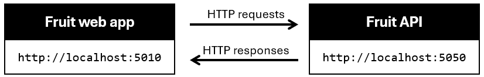
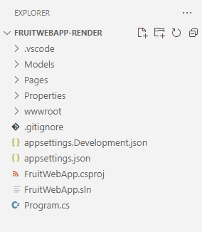

---
lab:
  title: "Ejercicio: Representar respuestas de API en Razor\_Pages de ASP.NET\_Core"
  module: 'Module: Render API responses in ASP.NET Core Razor Pages'
---

En este ejercicio, aprenderá a agregar el código a una aplicación Razor Pages de ASP.NET Core para representar resultados de operaciones HTTP. Este código se agrega a los archivos *.cshtml*. El código que realiza las operaciones en el archivo *.cshtml* está completo.

## Objetivos

Después de completar este ejercicio, podrá hacer lo siguiente:

* Implementar palabras clave de Razor en una aplicación
* Integrar el código C# con la sintaxis de Razor Pages

## Requisitos previos

Para completar el ejercicio, necesita que las herramientas siguientes estén instaladas en el sistema:

* [Visual Studio Code.](https://code.visualstudio.com)
* [El SDK de .NET 7.0 más reciente.](https://dotnet.microsoft.com/download/dotnet/7.0)
* La [extensión de C#](https://marketplace.visualstudio.com/items?itemName=ms-dotnettools.csharp) para Visual Studio Code.

**Tiempo estimado para finalizar este ejercicio**: 30 minutos

## Escenario del ejercicio

Este ejercicio tiene dos componentes:

* Una aplicación que envía solicitudes HTTP a una API. La aplicación se ejecuta en `http://localhost:5010`
* Una API que responde a solicitudes HTTP. La API se ejecuta en `http://localhost:5050`



## Descargar el código

En esta sección descargará el código de la aplicación web Fruit y la Fruit API. También puede ejecutar la Fruit API localmente para que esté disponible para la aplicación web.

### Tarea 1: descargar y ejecutar el código de API

1. Haga clic con el botón derecho en el siguiente vínculo y seleccione la opción **Guardar vínculo como**. 

    * [Código de proyecto de FruitAPI](https://raw.githubusercontent.com/MicrosoftLearning/APL-2002-develop-aspnet-core-consumes-api/master/Allfiles/Downloads/FruitAPI.zip)

1. Inicie **Explorador de archivos** y vaya a la ubicación donde se guardó el archivo.

1. Descomprima el archivo en su propia carpeta.

1. Abra **Terminal Windows** o un **símbolo del sistema** y vaya a la ubicación en la que extrajo el código de la API.

1. En el panel **Terminal Windows**, ejecute el siguiente comando `dotnet`:

    ```
    dotnet run
    ```

1. El siguiente es un ejemplo de la salida generada. Anote la  línea `Now listening on: http://localhost:5050` de la salida. Identifica el host y el puerto de la API.

    ```
    info: Microsoft.EntityFrameworkCore.Update[30100]
          Saved 3 entities to in-memory store.
    info: Microsoft.Hosting.Lifetime[14]
          Now listening on: http://localhost:5050
    info: Microsoft.Hosting.Lifetime[0]
          Application started. Press Ctrl+C to shut down.
    info: Microsoft.Hosting.Lifetime[0]
          Hosting environment: Development
    info: Microsoft.Hosting.Lifetime[0]
          Content root path: 
          <project location>
    ```

>**Nota:** Deje que Fruit API se ejecute en el resto del ejercicio. 

### Tarea 2: descargar y abrir el proyecto de aplicación web

1. Haga clic con el botón derecho en el siguiente vínculo y seleccione la opción **Guardar vínculo como**. 

    * [Código del proyecto de representación de la aplicación web Fruit](https://raw.githubusercontent.com/MicrosoftLearning/APL-2002-develop-aspnet-core-consumes-api/master/Allfiles/Downloads/FruitWebApp-render.zip)

1. Inicie **Explorador de archivos** y vaya a la ubicación donde se guardó el archivo.

1. Descomprima el archivo en su propia carpeta.

1. Inicie Visual Studio Code y seleccione **Archivo** y elija **Abrir carpeta...** en la barra de menús.

1. Vaya a la ubicación donde descomprimió los archivos del proyecto y seleccione la carpeta *FruitWebApp-render*.

1. La estructura del proyecto en el panel **Explorador** debe ser similar a la captura de pantalla siguiente. Si el panel **Explorador** no está visible, seleccione **Ver** y, a continuación, **Explorador** en la barra de menús.

    

>**Nota:** Dedique tiempo a revisar el código de cada uno de los archivos que se están editando en este ejercicio. El código está muy comentado y puede ayudarle a comprender la base de código.

## Implementación de código para representar datos en la página `Index`

La aplicación web Fruit muestra los datos de ejemplo de API en la página principal. Debe agregar código para recorrer en iteración los datos de muestra devueltos por la operación HTTP `GET` realizada en el archivo de código subyacente.

### Tarea 1: agregar código para representar datos en una tabla

1. Seleccione el archivo *Index.cshtml* en el panel **Explorador** para abrir el archivo en el editor.

1. Agregue el código siguiente entre los comentarios `@* Begin render API data code block *@` y `@* End render API data code block *@`.

    ```csharp
    <tbody>
        
        @*  The Razor keyword @foreach is used to iterate through the
            data returned to the data model from the HTTP operations. *@
        @foreach (var obj in Model.FruitModels)
        {
            <tr>
                @* Display the name of the fruit. *@
                <td width="50%">@obj.name</td>
                @*  The following if statment is a Razor code block that changes the color 
                    and icon of the available indicator in the page rendering. *@
                @{
                    if (@obj.instock)
                    {
                        <td width="20%" class="text-md-center">
                            <i class="bi bi-check-circle" style="font-size: 1rem; color: green;"></i>&nbsp;Yes
                        </td>
                    }
                    else
                    {
                        <td width="20%" class="text-md-center">
                            <i class="bi bi-dash-circle" style="font-size: 1rem; color:red;"></i>&nbsp;No
                        </td>
                    }
                }
                <td width="30%" class="text-center">
                    @*  The following div contains information to handle the edit and delete functions. *@
                    <div class="w-75 btn-group btn-group-sm" role="group" style="text-align:center">
                        @* Routes to the Edit page and passes the id of the record. *@
                        <a asp-page="Edit" asp-route-id="@obj.id" class="btn btn-primary  mx-2">
                            <i class="bi bi-pencil-square"></i> Edit
                        </a>
                        @* Routes to the Delete page and passes the id of the record. *@
                        <a asp-page="Delete" asp-route-id="@obj.id" class="btn btn-danger mx-2">
                            <i class="bi bi-trash"></i> Delete
                        </a>
                    </div>
                </td>
            </tr>
        }
    </tbody>
    ```

1. Guarde los cambios en *Index.cshtml* y revise los comentarios en el código.

1. En el menú superior de Visual Studio Code, seleccione **Ejecutar depuración de inicio de \|** o seleccione **F5**. Una vez que el proyecto haya terminado de compilar una ventana del explorador, debe iniciarse con la aplicación web en ejecución.

1. Compruebe que la página Índice muestra los datos de muestra de la API.

    >**Nota:** Las funciones **Agregar a lista**, **Editar** y **Eliminar** no funcionarán hasta que agregue código para ellas más adelante en este ejercicio.

    >**Nota:** Puede omitir de forma segura el mensaje siguiente si aparece al ejecutar la aplicación.

    

1. Para continuar con el ejercicio, cierre el explorador o la pestaña del explorador y, en Visual Studio Code, seleccione **Ejecutar depuración de inicio de \|** o **Mayús + F5**.

## Implementación de código para controlar la funcionalidad `Add to list`

Las operaciones de adición, edición y eliminación se controlan en una página *.cshtml* independiente del proyecto. En esta sección, agregará código para crear un formulario en el archivo *Add.cshtml* para habilitar la adición de datos a la lista.

### Tarea 1: agregar código para crear el formulario de agregación de datos

1. Seleccione el archivo *Add.cshtml* en el panel **Explorador** para abrir el archivo en el editor.

1. Agregue el código siguiente entre los comentarios `@* Begin render Add code block *@` y `@* End render Add code block *@`.

    ```csharp
    <form method="post">
        @*  The FruitModels.id is here so the full data model is represented on the page.
            The database behind the API will assign the id. *@
        <input hidden asp-for="FruitModels.id" />
        <div class="border p-3 mt-4" style="width:50%">
            <div class="row pb-2">
                <h2 class="text-primary pl-3">Add Fruit</h2>
                <hr />
            </div>
            <div class="mb-3">
                <label asp-for="FruitModels.name" class="h5"></label><br/>
                @* Empty text box for the name of the fruit to be added. *@
                <input type="text" asp-for="FruitModels.name" />
                <span asp-validation-for="FruitModels.name" class="text-danger"></span>
            </div>
            <div class="mb-3">
                <label asp-for="FruitModels.instock" class="h5"></label><br/>
                @* Render the true/false instock state from the record in an editable checkbox. *@
                <input type="checkbox" asp-for="FruitModels.instock" style="width:20px; height:20px" />
                <label class="h7"><i class="bi bi-arrow-left"></i>  Check the box if it's available.</label>
                <span asp-validation-for="FruitModels.instock" class="text-danger"></span>
            </div>
            @* Submit the addition or return to the Index page if the Add is cancelled.*@
            <button type="submit" class="btn btn-primary" style="width:150px;">Create</button>
            <a asp-page="Index" class="btn btn-secondary" style="width:150px;">Cancel</a>
        </div>
    </form>
    ```

1. Guarde los cambios en *Add.cshtml* y revise los comentarios en el código.

1. En el menú superior de Visual Studio Code, seleccione **Ejecutar depuración de inicio de \|** o seleccione **F5**. Una vez que el proyecto haya terminado de compilar una ventana del explorador, debe iniciarse con la aplicación web en ejecución.

1. Seleccione **Agregar a la lista** en la página.

1. Escriba el nombre de una fruta que desee agregar a la lista y active la casilla para indicar que está disponible.

1. Seleccione **Crear** para agregar la entrada a la lista y se le redirigirá a la página principal. Compruebe que la entrada se agregó a la lista.

1. Para continuar con el ejercicio, cierre el explorador o la pestaña del explorador y, en Visual Studio Code, seleccione **Ejecutar depuración de inicio de \|** o **Mayús + F5**.

## Implementación de código para controlar la funcionalidad `Edit`

En esta sección, agregará código para crear un formulario en el archivo *Edit.cshtml* para habilitar la edición de datos de la lista.

### Tarea 1: agregar código para el formulario de edición

1. Seleccione el archivo *Edit.cshtml* en el panel **Explorador** para abrir el archivo en el editor.

1. Agregue el código siguiente entre los comentarios `@* Begin render Edit code block *@` y `@* End render Edit code block *@`.

    ```csharp
    <form method="post">
        @*  The id for the data record is hidden because it needs to be available to the 
            code-behind processing, but it's not displayed. *@
        <input hidden asp-for="FruitModels.id" />
        <div class="border p-3 mt-4" style="width:50%">
            <div class="row pb-2">
                <h2 class="text-primary pl-3">Edit Fruit</h2>
                <hr />
            </div>
            <div class="mb-3">
                <label asp-for="FruitModels.name" class="h5"></label><br/>
                @* Render the current name of the fruit in an editable text box. *@
                <input type="text" asp-for="FruitModels.name" />
                <span asp-validation-for="FruitModels.name" class="text-danger"></span>
            </div>
            <div class="mb-3">
                <label asp-for="FruitModels.instock" class="h5"></label><br/>
                @* Render the true/false instock state from the record in an editable checkbox. *@
                <input type="checkbox" asp-for="FruitModels.instock" style="width:20px; height:20px" />
                <label class="h7"><i class="bi bi-arrow-left"></i>  Check the box if available.</label>
                <span asp-validation-for="FruitModels.instock" class="text-danger"></span>
            </div>
            @* Submit the changes or return to the Index page if the edit is cancelled.*@
            <button type="submit" class="btn btn-primary" style="width:150px;">Update</button>
            <a asp-page="Index" class="btn btn-secondary" style="width:150px;">Cancel</a>
        </div>
    </form>
    ```

1. Guarde los cambios en *Edit.cshtml* y revise los comentarios en el código.

1. En el menú superior de Visual Studio Code, seleccione **Ejecutar depuración de inicio de \|** o seleccione **F5**. Una vez que el proyecto haya terminado de compilar una ventana del explorador, debe iniciarse con la aplicación web en ejecución.

1. Elija un elemento de la lista que quiera cambiar y seleccione **Editar** en esa fila.

1. Edite el nombre de la fruta y active la casilla para cambiar su estado de disponibilidad.

1. Seleccione **Actualizar** para guardar los cambios y se le redirigirá a la página principal. Compruebe que el cambio se muestra en la lista.

1. Para continuar con el ejercicio, cierre el explorador o la pestaña del explorador y, en Visual Studio Code, seleccione **Ejecutar depuración de inicio de \|** o **Mayús + F5**.

## Implementación de código para controlar la funcionalidad `Delete`

En esta sección, agregará código para crear un formulario en el archivo *Delete.cshtml* para habilitar la eliminación de datos de la lista.

### Tarea 1: agregar código para el formulario de eliminación

1. Seleccione el archivo *Delete.cshtml* en el panel **Explorador** para abrir el archivo en el editor.

1. Agregue el código siguiente entre los comentarios `@* Begin render Delete code block *@` y `@* End render Delete code block *@`.

    ```csharp
    <form method="post">
        @*  The id for the data record is hidden because it needs to be avaialable to the 
            code-behind processing, but it's not displayed. *@
        <input hidden asp-for="FruitModels.id" />
        <div class="border p-3 mt-4" style="width:50%">
            <div class="row pb-2">
                <h2 class="text-primary pl-3">Delete Fruit</h2>
                <hr />
            </div>
            <div class="mb-3">
                <label asp-for="FruitModels.name" class="h5"></label><br/>
                @* Render the name of the fruit in a non-editable text box. *@
                <input type="text" asp-for="FruitModels.name" disabled/>
                <span asp-validation-for="FruitModels.name" class="text-danger"></span>
            </div>
            <div class="mb-3">
                <label asp-for="FruitModels.instock" class="h5"></label><br/>
                @* Render the true/false instock state from the record in a non-editable checkbox. *@
                <input type="checkbox" asp-for="FruitModels.instock" style="width:20px; height:20px" disabled  />
                <span asp-validation-for="FruitModels.instock" class="text-danger"></span>
            </div>
            @* Submit the changes or return to the Index page if the delete is cancelled.*@
            <button type="submit" class="btn btn-danger " style="width:150px;">Delete</button>
            <a asp-page="Index" class="btn btn-secondary" style="width:150px;">Cancel</a>
        </div>
    </form>
    ```

1. Guarde los cambios en *Delete.cshtml* y revise los comentarios en el código.

1. En el menú superior de Visual Studio Code, seleccione **Ejecutar depuración de inicio de \|** o seleccione **F5**. Una vez que el proyecto haya terminado de compilar una ventana del explorador, debe iniciarse con la aplicación web en ejecución.

1. Elija un elemento de la lista que quiera eliminar y seleccione **Eliminar** en esa fila.

1. Seleccione **Eliminar** y se le redirigirá de nuevo a la página principal. Compruebe que el elemento que ha eliminado ya no se muestra en la lista.

Cuando tenga todo listo para finalizar el ejercicio:

* Cierre el explorador o la pestaña del explorador y, en Visual Studio Code, seleccione **Ejecutar depuración de finalización de \|** o **Mayús + F5**. 

* Detenga Fruit API escribiendo `Ctrl + C` en el terminal en el que se ejecuta.

## Revisar

En este ejercicio ha aprendido a hacer lo siguiente:

* Implementar palabras clave de Razor en una aplicación
* Integrar el código C# con la sintaxis de Razor Pages
